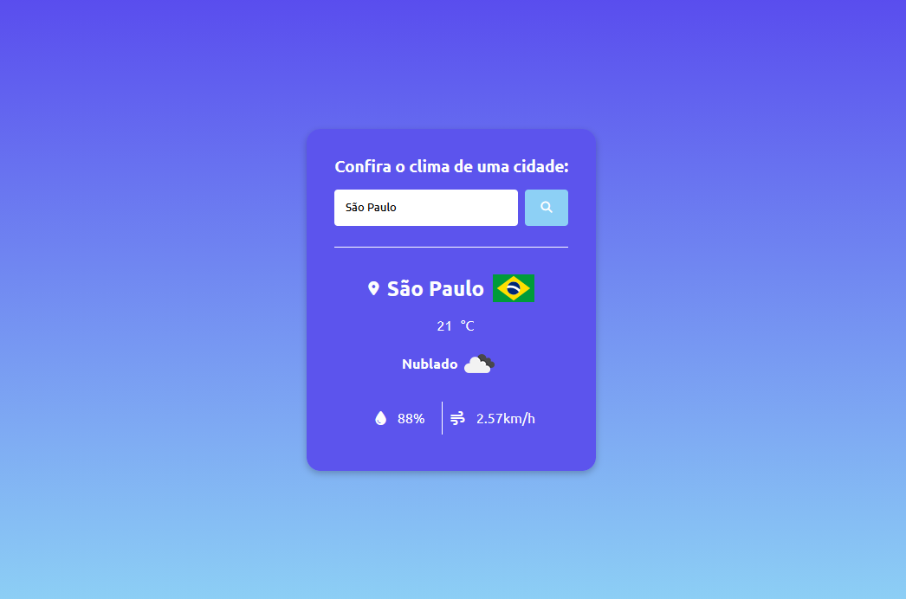

 

# 🌤️ Weather Search App

Uma aplicação interativa de busca de clima em tempo real que utiliza a API do OpenWeatherMap. O projeto foi refatorado para incluir um Backend Proxy em Node.js, garantindo que a chave da API não seja exposta no navegador do utilizador.



## 🎯 Sobre o Projeto

O Weather Search permite obter informações meteorológicas instantâneas, como temperatura, condições climáticas, humidade e velocidade do vento. A arquitetura atual utiliza:

- **Frontend:** Interface moderna e responsiva.

- **Backend:** Servidor Node.js que atua como intermediário (Proxy) para segurança de credenciais.

- **Estado Global:** Gestão centralizada dos dados para uma interface mais previsível.

O projeto foi construído com foco em **Clean Code** e **Experiência do Usuário (UX)**, utilizando alertas personalizados e manipulação dinâmica do DOM.


## 🛠️ Funcionalidades Detalhadas

* **Validação de Input:** O sistema impede buscas vazias com alertas visuais.
* **Tratamento de Erros:** Caso a cidade não exista (Erro 404) ou ocorra um problema no servidor, o usuário é notificado via SweetAlert.
* **Suporte ao Teclado:** É possível realizar a busca pressionando a tecla `Enter`.
* **Interface Dinâmica:** O cartão de informações só aparece após a primeira busca bem-sucedida.


## 🚀 Tecnologias Utilizadas

O projeto foi desenvolvido utilizando as seguintes tecnologias:

- **Frontend:** HTML5, CSS3, JavaScript (ES6+).
- **Backend:** Node.js, Express, Axios, Cors, Dotenv.
- **APIs:** [OpenWeatherMap API](https://openweathermap.org/api) e [Country Flag Icons](https://purecatamphetamine.github.io/country-flag-icons/)
- **Feedback visual:** [SweetAlert2](https://sweetalert2.github.io/) e [Font Awesome](https://fontawesome.com/)


## ⚙️ Como Executar o Projeto

1.  **Preparar o Backend:**

Navegue até a pasta do servidor e instale as dependências:

```bash
cd weather-backend
npm install
```


2. **Configurar as Variáveis de Ambiente**

Crie um arquivo `.env` na raiz da pasta `weather-backend` (baseado no .env.example):

```
PORT=3000
WEATHER_API_KEY=SUA_CHAVE_AQUI
```


3.  **Crie sua chave de API:**
    * Crie uma conta no [OpenWeatherMap](https://openweathermap.org/).
    * Dentro do arquivo `.env` adicione a chave.

**Nota:** Nunca envie o arquivo `.env` para o GitHub. Ele já está listado no `.gitignore`.


4.  **Iniciar o servidor:**

```
npm run dev
```

O servidor ficará disponível em `http://localhost:3000`
